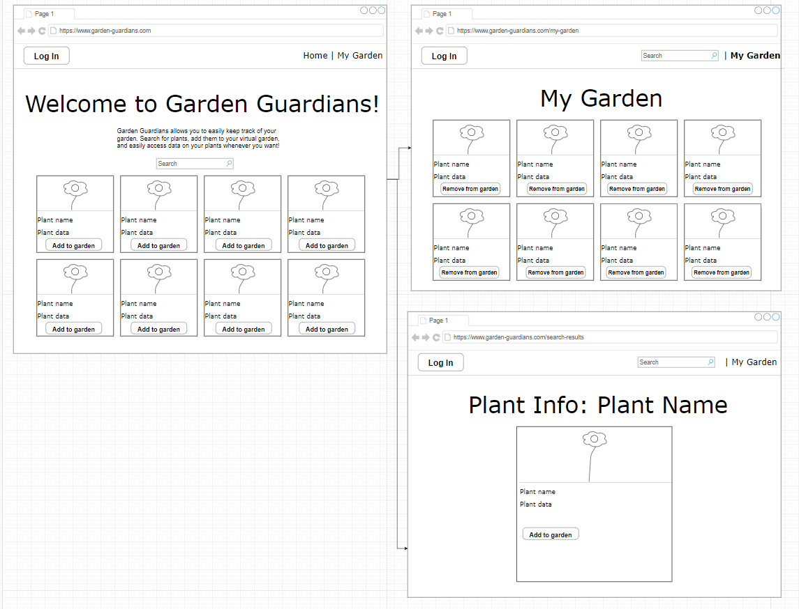

# OBJECTIVE (AJ)
Knowing when to water, or how much, is many gardeners' top challenge when it comes to keeping their plants alive and well. 
Garden Guardian serves as an easy-to-use virtual tool that takes the guesswork out of watering! 
Users can search to find any plant or crop imaginable, choose to save it to their "likes" page, or add it to their garden right away. 
For each plant, the user tells Garden Guardian how often it needs to be watered. 
Using real-time weather data, Garden Gaurdian delivers all you need to know regarding each plant's watering needs for the week ahead.

# DEMO (AJ)
Garden Guardian is deployed to Heroku. Check it out at https://gardenguardian.herokuapp.com/ 

# PARTICULAR "PROUD OF" (KAYLA)
- A key Garden Guardian piece is the calendar portion. This demanded careful coding to make weather data and user input regarding each particular plant's watering needs work in harmoney in order to deliver an easy-to-read and helpful look at the week ahead for the user.

# TECHNOLOGY STACK (JACOB)

1. Frontend
- Javascript
- HTML
- CSS

2. Backend
- Open Weather Maps API
- Trefle API
- Authentication with Auth0
- Javascript
- NodeJS
- ExpressJS web server
- Sequelize ORM
- MySQL

# CHALLENGES (ASHLEY)

- Deploying to Heroku proved challenging; specifically, we had to alter CSS so that our homepage background didn't have the opacity it originally did, unfortunately.

- Re-rendering upon state changes.

# APP CONTENTS

1. Home page
    a. Search bar
    b. Text with general information n Auth0 login page and then redirects back to our app (technology #1)
about the app/what the user can do ****
    c. Login button - takes user to a

2. Search results
    a. Cards containing plants matching the search query
    b. Each card has an “Add to garden” button

3. Garden Overview page
    a. Cards containing plants added to garden
    b. Each card has an “Remove from garden” button
    c. Calendar

# WIREFRAMES

# SCREENSHOT

    

